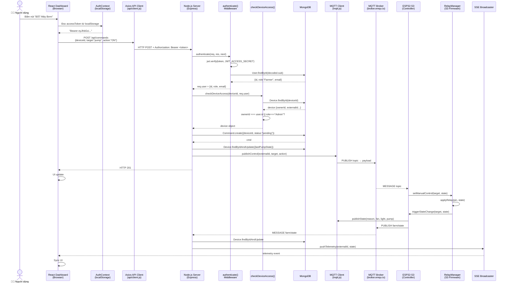
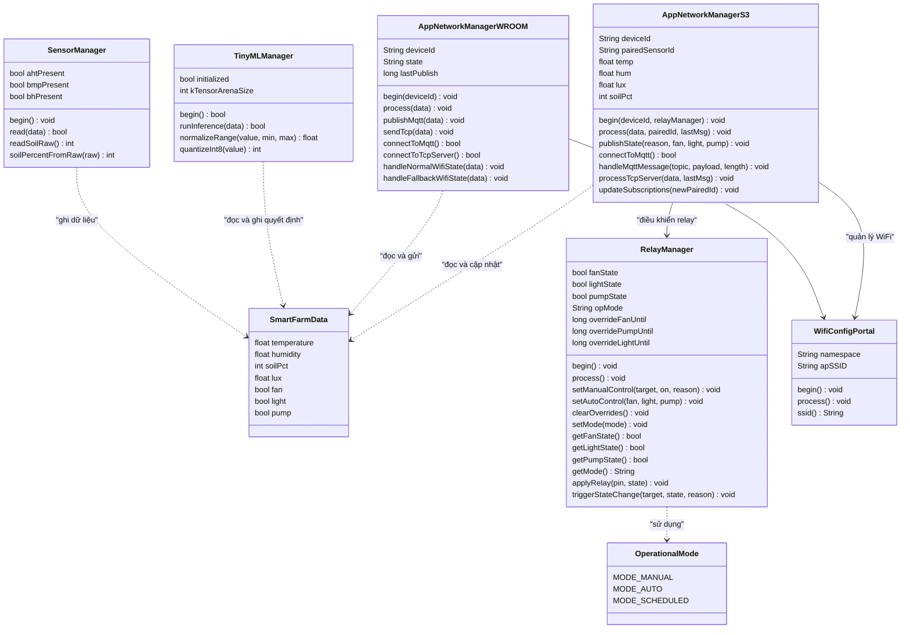
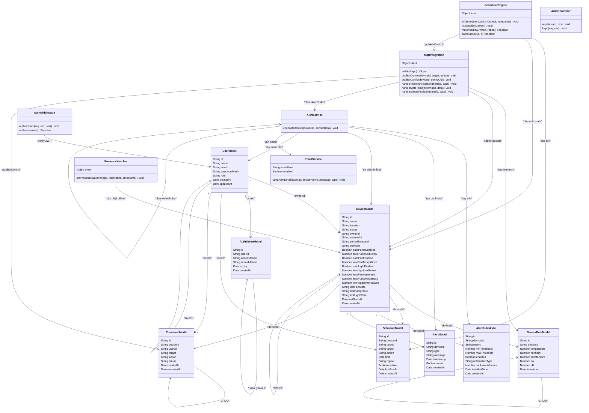
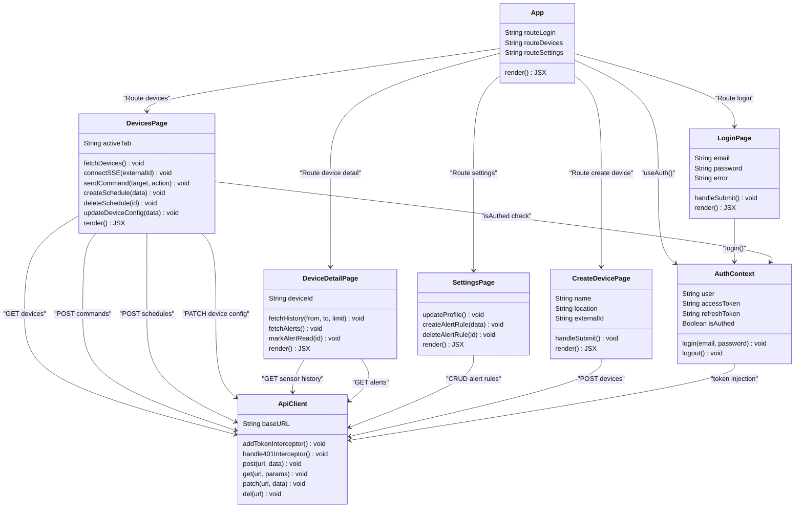

# 3.3. Phân tích Thiết kế Phần mềm bằng Ngôn ngữ UML

---

## 3.3.1. Sơ đồ Ca sử dụng (Use Case Diagram) Tổng thể

```mermaid
flowchart TD
    subgraph ACTORS["Tác nhân (Actors)"]
        FARMER["👨‍🌾 Farmer\n(Nông dân)"]
        ADMIN["👑 Admin\n(Quản trị viên)"]
        DEVICE["🤖 ESP32 Device\n(Thiết bị IoT)"]
        SYSTEM["⚙️ System\n(Hệ thống tự động)"]
    end

    subgraph UC_AUTH["Nhóm UC: Xác thực"]
        UC01["UC01\nĐăng ký tài khoản"]
        UC02["UC02\nĐăng nhập"]
        UC03["UC03\nLàm mới Token"]
        UC04["UC04\nĐăng xuất"]
    end

    subgraph UC_MONITOR["Nhóm UC: Giám sát"]
        UC05["UC05\nXem dữ liệu cảm biến\nthời gian thực"]
        UC06["UC06\nXem lịch sử cảm biến\nvà biểu đồ phân tích"]
        UC07["UC07\nXem trạng thái\nthiết bị online/offline"]
        UC08["UC08\nXem nhật ký\ncảnh báo hệ thống"]
    end

    subgraph UC_CONTROL["Nhóm UC: Điều khiển"]
        UC09["UC09\nĐiều khiển thủ công\nbật/tắt thiết bị"]
        UC10["UC10\nChuyển chế độ\nvận hành (manual/auto/scheduled)"]
        UC11["UC11\nCấu hình ngưỡng\ntự động hóa & hysteresis"]
        UC12["UC12\nCấu hình khung giờ\nan toàn (Safety Windows)"]
    end

    subgraph UC_SCHEDULE["Nhóm UC: Lịch trình"]
        UC13["UC13\nTạo lịch trình\ntưới tự động"]
        UC14["UC14\nSửa / Xóa lịch trình"]
        UC15["UC15\nTạm dừng / Kích hoạt\nlịch trình"]
    end

    subgraph UC_ALERT["Nhóm UC: Cảnh báo"]
        UC16["UC16\nCấu hình quy tắc\ncảnh báo ngưỡng"]
        UC17["UC17\nNhận cảnh báo\ntrong Dashboard"]
        UC18["UC18\nNhận cảnh báo\nqua Email"]
        UC19["UC19\nĐánh dấu\ncảnh báo đã đọc"]
    end

    subgraph UC_DEVICE_MGT["Nhóm UC: Quản lý thiết bị"]
        UC20["UC20\nĐăng ký thiết bị mới"]
        UC21["UC21\nGhép cặp WROOM-S3\n(pairedSensorId)"]
        UC22["UC22\nXóa thiết bị\n(cascade delete)"]
        UC23["UC23\nXem nhật ký\nhệ thống (SystemLog)"]
    end

    subgraph UC_AUTO["Nhóm UC: Tự động hóa (System)"]
        UC24["UC24\nSuy luận TinyML\ncục bộ trên WROOM"]
        UC25["UC25\nKiểm tra cảnh báo\nsau mỗi lần nhận dữ liệu"]
        UC26["UC26\nThực thi lịch\n(Scheduler tick 30s)"]
        UC27["UC27\nPhát hiện thiết bị\noffline (Presence 30s)"]
        UC28["UC28\nKiểm tra Safety\nWindow (Server Gate)"]
    end

    %% Farmer associations
    FARMER --> UC02
    FARMER --> UC05
    FARMER --> UC06
    FARMER --> UC07
    FARMER --> UC08
    FARMER --> UC09
    FARMER --> UC10
    FARMER --> UC11
    FARMER --> UC12
    FARMER --> UC13
    FARMER --> UC14
    FARMER --> UC15
    FARMER --> UC16
    FARMER --> UC17
    FARMER --> UC18
    FARMER --> UC19
    FARMER --> UC20
    FARMER --> UC21

    %% Admin extends Farmer
    ADMIN --> FARMER
    ADMIN --> UC22
    ADMIN --> UC23

    %% Device associations
    DEVICE --> UC24
    DEVICE --> UC01:::hidden

    %% System associations
    SYSTEM --> UC25
    SYSTEM --> UC26
    SYSTEM --> UC27
    SYSTEM --> UC28

    %% Include/Extend relationships
    UC02 -.->|"«include»"| UC03
    UC09 -.->|"«include»"| UC10
    UC25 -.->|"«extend»"| UC18
    UC24 -.->|"«extend»"| UC28
```



---

## 3.3.2. Đặc tả Các Use Case Cốt lõi

### UC02 — Đăng nhập Hệ thống

| Thuộc tính | Nội dung |
|---|---|
| **Mã Use Case** | UC02 |
| **Tên** | Đăng nhập hệ thống |
| **Tác nhân chính** | Farmer, Admin |
| **Tiền điều kiện** | Người dùng đã có tài khoản và chưa đăng nhập; ứng dụng Web đang chạy |
| **Hậu điều kiện** | Người dùng được cấp cặp `{accessToken, refreshToken}`; JWT lưu vào `localStorage`; chuyển hướng đến `/devices` |
| **Luồng chính** | 1. Người dùng truy cập `/login` và nhập `email`, `password` |
| | 2. Dashboard gọi `POST /api/auth/login` qua Axios client |
| | 3. Server validate input bằng `express-validator` |
| | 4. Server tra cứu User theo email trong MongoDB |
| | 5. Server so sánh `bcrypt.compare(password, passwordHash)` |
| | 6. Nếu khớp: tạo `accessToken` (JWT ngắn hạn) và `refreshToken` (JWT 7 ngày) |
| | 7. Lưu cặp token vào collection `authtokens` (MongoDB) |
| | 8. Trả về `{accessToken, refreshToken, user}` — HTTP 200 |
| | 9. `AuthContext` lưu token vào `localStorage` và cập nhật React state `isAuthed = true` |
| | 10. React Router chuyển hướng đến `/devices` |
| **Luồng thay thế** | 4a. Email không tồn tại → HTTP 401 "Invalid credentials" |
| | 5a. Mật khẩu sai → HTTP 401 "Invalid credentials" |
| | 3a. Input không hợp lệ (email sai định dạng, password < 6 ký tự) → HTTP 422 |
| **Luồng ngoại lệ** | MongoDB không kết nối được → HTTP 500 |
| **Ràng buộc** | Mật khẩu tối thiểu 6 ký tự; rate limit 120 req/phút |

---

### UC05 — Giám sát Dữ liệu Cảm biến Thời gian thực

| Thuộc tính | Nội dung |
|---|---|
| **Mã Use Case** | UC05 |
| **Tên** | Giám sát dữ liệu cảm biến thời gian thực |
| **Tác nhân chính** | Farmer, Admin |
| **Tiền điều kiện** | Người dùng đã đăng nhập; thiết bị ESP32 WROOM đang online và gửi MQTT telemetry |
| **Hậu điều kiện** | Dashboard cập nhật giá trị nhiệt độ, độ ẩm, lux, độ ẩm đất và trạng thái relay liên tục |
| **Luồng chính** | 1. Người dùng mở tab **"Tổng quan"** tại `/devices?tab=overview` |
| | 2. Dashboard mở kết nối SSE: `GET /api/stream/devices/:externalId?token=<JWT>` |
| | 3. Server xác thực JWT từ query param; thêm client vào `sseClients` Set |
| | 4. ESP32 WROOM đọc cảm biến (AHT20, BH1750, ADC) mỗi 5 giây |
| | 5. WROOM chạy TinyML inference, gửi MQTT `farm/<id>/telemetry` mỗi 10 giây |
| | 6. Server nhận MQTT message, lưu vào `SensorData` collection |
| | 7. Server gọi `pushTelemetry(externalId, payload)` → ghi vào SSE stream |
| | 8. Dashboard nhận SSE `event: telemetry`, cập nhật React state |
| | 9. Biểu đồ và card số liệu re-render với dữ liệu mới |
| **Luồng thay thế** | 4a. Thiết bị offline (không gửi >120 giây): `PresenceWatcher` đổi `status = 'offline'`; SSE `event: status` thông báo Dashboard hiển thị badge đỏ |
| | 2a. JWT hết hạn: SSE trả HTTP 401, Dashboard redirect về `/login` |
| **Ràng buộc** | Dashboard không cần reload trang; cập nhật push-based (không polling) |

---

### UC09 — Điều khiển Thủ công Bật/Tắt Thiết bị

| Thuộc tính | Nội dung |
|---|---|
| **Mã Use Case** | UC09 |
| **Tên** | Điều khiển thủ công bật/tắt thiết bị chấp hành |
| **Tác nhân chính** | Farmer (thiết bị của mình), Admin (toàn bộ) |
| **Tiền điều kiện** | Người dùng đã đăng nhập; thiết bị ESP32-S3 đã đăng ký và có `externalId` |
| **Hậu điều kiện** | Relay vật lý trên ESP32-S3 thay đổi trạng thái; Dashboard cập nhật trạng thái relay qua SSE |
| **Luồng chính** | 1. Người dùng chọn tab **"Điều khiển"**, chọn thiết bị và bấm nút "BẬT Máy bơm" |
| | 2. Dashboard gọi `POST /api/commands` `{deviceId, target:"pump", action:"ON"}` |
| | 3. Server middleware `authenticate()` xác minh JWT |
| | 4. `checkDeviceAccess(deviceId, user)` kiểm tra quyền sở hữu |
| | 5. `Command.create({deviceId, userId, target, action, status:'pending'})` |
| | 6. Server cập nhật `Device.lastPumpState = 'ON'` ngay lập tức (optimistic) |
| | 7. Server publish MQTT: `farm/<s3-id>/control/pump → "ON"` (QoS 1) |
| | 8. ESP32-S3 nhận MQTT `handleMqttMessage()`: `target="pump"`, `on=true` |
| | 9. `RelayManager.setManualControl("pump", true, "command")` → `applyRelay(pin 18, HIGH)` |
| | 10. S3 publish `farm/<s3-id>/state {relay_pump:true, opMode:"manual"}` |
| | 11. Server nhận state message → `pushTelemetry()` → SSE → Dashboard cập nhật UI |
| **Luồng thay thế** | 4a. Người dùng Farmer không sở hữu thiết bị → HTTP 403 |
| | 7a. S3 đang offline: lệnh ở trạng thái `queued`; S3 poll `GET /api/commands/next` khi reconnect |
| | 9a. S3 đang trong thời gian Manual Override Lock (5 phút): lệnh MQTT bị từ chối ở firmware |
| **Ràng buộc** | `minToggleIntervalSec` giới hạn tần suất đóng ngắt relay để bảo vệ phần cứng |

---

### UC13 — Cấu hình Lịch trình Tưới Tự động

| Thuộc tính | Nội dung |
|---|---|
| **Mã Use Case** | UC13 |
| **Tên** | Tạo lịch trình tưới/điều khiển tự động định kỳ |
| **Tác nhân chính** | Farmer, Admin |
| **Tác nhân phụ** | System (Scheduler Engine thực thi) |
| **Tiền điều kiện** | Người dùng đã đăng nhập; thiết bị đã đăng ký; thiết bị có `externalId` hợp lệ |
| **Hậu điều kiện** | Bản ghi `Schedule` được tạo trong DB với `active = true`; Scheduler Engine sẽ thực thi vào đúng giờ |
| **Luồng chính** | 1. Người dùng mở tab **"Cài đặt thiết bị"** → phần Lịch trình |
| | 2. Người dùng chọn thiết bị đích, thành phần (`fan/light/pump`), hành động (`ON/OFF`), giờ thực thi, chu kỳ (`daily/weekly`) |
| | 3. Dashboard gọi `POST /api/schedules` `{deviceId, target, action, time, repeat}` |
| | 4. Server tạo `Schedule` document với `active = true` |
| | 5. Trả về HTTP 201 và bản ghi schedule |
| | **Thực thi tự động (tác nhân System):** |
| | 6. `Scheduler.tick()` chạy mỗi 30 giây, truy vấn `Schedule.find({active:true})` |
| | 7. Hàm `matches(now, when, repeat)` so sánh giờ/phút hiện tại với `schedule.time` |
| | 8. Kiểm tra `sameMinute(now, lastRunAt)` để tránh chạy lại trùng trong cùng phút |
| | 9. Nếu khớp: `publishControl(deviceId, target, action)` → MQTT |
| | 10. Cập nhật `Schedule.lastRunAt = now` và `Device.last{Target}State` |
| **Luồng thay thế** | 2a. Người dùng tạm dừng lịch: `PATCH /api/schedules/:id {active: false}` → Scheduler bỏ qua |
| | 7a. Repeat = 'weekly': thêm kiểm tra `now.getDay() === when.getDay()` |
| **Ràng buộc** | Độ phân giải tối thiểu của lịch là **1 phút** (do tick 30 giây); lịch cần có `deviceId` của S3 controller để publish đúng topic MQTT |

---

## 3.3.3. Sơ đồ Hoạt động (Activity Diagram) — Luồng Tự động hóa TinyML và Ngưỡng Cảm biến

```mermaid
flowchart TD
    START(["⬤ Bắt đầu\n(WROOM loop())"])

    %% WROOM side
    A1["Đọc cảm biến\nAHT20 · BH1750 · ADC\n(mỗi 5 giây)"]
    A2{Đọc\nthành công?}
    A3["Chuẩn hóa đầu vào\nnormalize(temp, hum, soil, lux)\n→ [0,1]"]
    A4["Chạy TinyML Inference\n(TFLite Micro Interpreter)"]
    A5["Áp dụng Hysteresis\nON ≥ 0.60 / OFF ≤ 0.45\n→ {fan, light, pump: bool}"]
    A6["Gửi MQTT mỗi 10s\nfarm/<id>/telemetry\nfarm/<id>/ai_state"]

    %% MQTT Broker
    B1[["MQTT Broker\n(broker.emqx.io)"]]

    %% Server side - Telemetry processing
    C1["Server nhận\nfarm/<id>/telemetry"]
    C2["Lưu SensorData\nvào MongoDB"]
    C3["Cập nhật Device\nstatus=online, lastSeenAt"]
    C4["pushTelemetry() → SSE\n→ Dashboard cập nhật"]

    %% Server side - Alert checking
    C5["checkAlertRules()\n[bất đồng bộ]"]
    C6["Tải AlertRule\n{deviceId, enabled:true}"]
    C7{value ngoài\nngưỡng?}
    C8{Đã qua\ncooldown?}
    C9["Alert.create()\nread=false"]
    C10{notificationType\n= email|all?}
    C11["sendAlertEmail()\nnodemailer SMTP"]

    %% Server side - AI State processing
    D1["Server nhận\nfarm/<wroom-id>/ai_state"]
    D2["Tìm S3 Controller\ncó pairedSensorId = wroom-id"]
    D3{S3 tìm\nthấy?}
    D4{S3 opMode?}
    D5{Có safetyWindows\nVÀ ngoài khung giờ?}
    D6["allowedPump = false\n(Lockout AI pump)"]
    D7["Giữ nguyên\ncài đặt AI"]
    D8["Ghi đè: dùng\ntrạng thái hiện tại S3\n(không để AI can thiệp)"]
    D9["Publish\nfarm/<wroom-id>/state\n{fan, light, pump}"]

    %% S3 side
    E1[["farm/<wroom-id>/state\n→ ESP32-S3 nhận"]]
    E2["setAutoControl\n(fan, light, pump)"]
    E3{Manual\nOverride đang\nkích hoạt?}
    E4["Bỏ qua AI\n(tôn trọng thao tác\nngười dùng)"]
    E5["applyRelay()\n→ Relay vật lý thay đổi"]
    E6["triggerStateChange callback\n→ publishState()"]
    E7["MQTT farm/<s3-id>/state\n→ Server đồng bộ DB + SSE"]

    END(["⬤ Kết thúc vòng lặp"])

    %% Scheduler flow
    S1["SchedulerEngine.tick()\n(mỗi 30 giây)"]
    S2["Schedule.find({active:true})"]
    S3{matches(now,\nwhen, repeat)?}
    S4{sameMinute\n(lastRunAt)?}
    S5["publishControl()\n→ MQTT farm/<id>/control/<target>"]
    S6["Cập nhật lastRunAt\nDevice.lastState"]

    START --> A1
    A1 --> A2
    A2 -->|Thất bại| A1
    A2 -->|Thành công| A3
    A3 --> A4
    A4 --> A5
    A5 --> A6

    A6 --> B1
    B1 --> C1
    B1 --> D1

    C1 --> C2
    C2 --> C3
    C3 --> C4
    C3 --> C5
    C5 --> C6
    C6 --> C7
    C7 -->|Không| END
    C7 -->|Có| C8
    C8 -->|Chưa qua| END
    C8 -->|Đã qua| C9
    C9 --> C10
    C10 -->|Có| C11
    C10 -->|Không| END
    C11 --> END

    D1 --> D2
    D2 --> D3
    D3 -->|Không tìm thấy| D9
    D3 -->|Tìm thấy| D4
    D4 -->|"auto"| D5
    D4 -->|"manual / scheduled"| D8
    D5 -->|Có, bị lockout| D6
    D5 -->|Không, trong giờ an toàn| D7
    D6 --> D9
    D7 --> D9
    D8 --> D9

    D9 --> E1
    E1 --> E2
    E2 --> E3
    E3 -->|Có| E4
    E3 -->|Không| E5
    E4 --> END
    E5 --> E6
    E6 --> E7
    E7 --> END

    S1 --> S2
    S2 --> S3
    S3 -->|Không khớp| END
    S3 -->|Khớp| S4
    S4 -->|Đã chạy phút này| END
    S4 -->|Chưa chạy| S5
    S5 --> S6
    S6 --> END
```

---

## 3.3.4. Sơ đồ Tuần tự (Sequence Diagram) — Gửi Lệnh Điều khiển từ Web qua MQTT tới ESP32



---

## 3.3.5. Sơ đồ Lớp (Class Diagram) — Cấu trúc Mã nguồn Toàn hệ thống

### 3.3.5.1. Tầng Phần cứng — ESP32 Firmware



### 3.3.5.2. Tầng Backend — Node.js Server



### 3.3.5.3. Tầng Frontend — React Dashboard



---

## Tóm tắt Phân tích UML

| Sơ đồ | Phần tử chính | Mục đích |
|---|---|---|
| **Use Case** | 5 nhóm UC, 28 use case, 4 tác nhân | Phạm vi chức năng toàn hệ thống |
| **UC Specs** | 4 use case cốt lõi với luồng chi tiết | Đặc tả luồng nghiệp vụ chính xác theo code |
| **Activity** | 3 luồng song song (Telemetry + Alert + Scheduler), Safety Gate | Logic tự động hóa kết hợp TinyML + Server |
| **Sequence** | 16 đối tượng tham gia, dual-topic MQTT, callback chain | Luồng điều khiển end-to-end với độ trễ < 1s |
| **Class** | 3 tầng: Firmware (7 lớp) + Backend (15 lớp) + Frontend (8 lớp) | Cấu trúc code thực tế toàn hệ thống |
