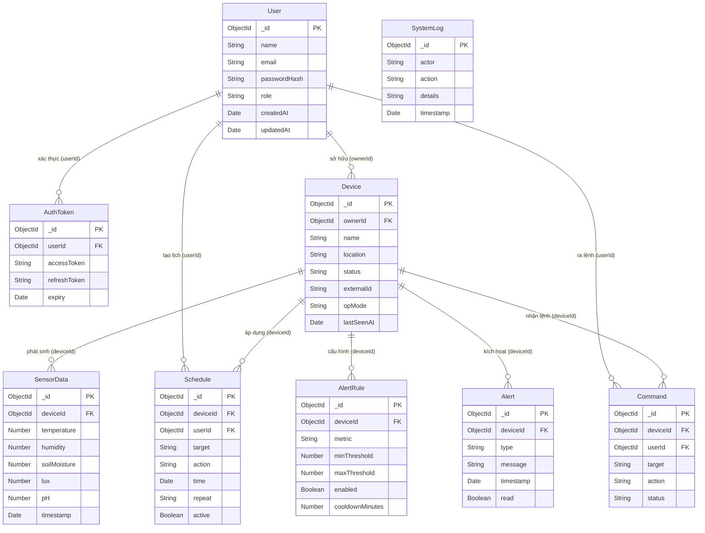

# 3.4. Thiết kế Cơ sở dữ liệu (Database Design)

## 3.4.1. Lựa chọn Hệ quản trị Cơ sở dữ liệu

Hệ thống Smart Farm sử dụng **MongoDB** — một hệ quản trị cơ sở dữ liệu hướng tài liệu (Document-oriented) — thay vì mô hình quan hệ truyền thống (RDBMS). Quyết định này xuất phát từ các đặc thù kỹ thuật của bài toán IoT nông nghiệp:

**Lý do thiết kế theo mô hình Document-oriented:**

1. **Schema linh hoạt cho dữ liệu cảm biến không đồng nhất:** Mỗi trạm ESP32 trong hệ thống (S1 — WROOM cảm biến môi trường, S2 — WROOM pH, S3 — S3 điều khiển) có tập hợp cảm biến khác nhau. MongoDB cho phép các bản ghi `SensorData` có cấu trúc tự do, không bắt buộc phải điền đủ mọi trường — ví dụ, một trạm cảm biến môi trường sẽ có `temperature`, `humidity`, `lux` nhưng không có `pH`, trong khi đó một trạm đo pH chỉ có trường `pH`. Nếu dùng RDBMS, điều này sẽ tạo ra nhiều cột `NULL` không cần thiết hoặc phải duy trì nhiều bảng phức tạp.

2. **Hiệu năng ghi cao cho luồng telemetry thời gian thực:** Dữ liệu cảm biến được ghi liên tục qua giao thức MQTT mỗi 5–30 giây từ các trạm. MongoDB, với cơ chế ghi không đồng bộ và chỉ mục kép `{ deviceId, timestamp }`, đảm bảo độ trễ ghi thấp và truy vấn lịch sử nhanh theo chuỗi thời gian.

3. **Tham chiếu ID thay vì nhúng (Embedding) cho các thực thể trung tâm:** Thiết kế sử dụng chiến lược **tham chiếu ID (ID Reference)** giữa các collection thay vì nhúng trực tiếp (Embedding). Lý do là các thực thể như `Device`, `User`, `SensorData` được truy cập độc lập và thường xuyên cập nhật riêng lẻ. Việc nhúng, ví dụ nhúng toàn bộ SensorData vào Document Device, sẽ dẫn đến Document vượt giới hạn 16MB của MongoDB và làm chậm hiệu suất đọc metadata thiết bị. Tham chiếu qua `ObjectId` giữ kích thước Document nhỏ gọn và cho phép `populate()` linh hoạt khi cần dữ liệu đầy đủ.

4. **Nhúng trực tiếp (Embedding) cho dữ liệu phụ thuộc vòng đời:** Một số thông tin có vòng đời gắn liền với Document cha được nhúng trực tiếp để tối ưu truy vấn. Ví dụ điển hình là `safetyWindows` (mảng các khung giờ an toàn `{start, end}`) được nhúng trực tiếp trong Document `Device`, vì dữ liệu này luôn được đọc cùng với cấu hình thiết bị và không bao giờ truy vấn độc lập.

---

## 3.4.2. Sơ đồ Mối quan hệ giữa các Collection



---

## 3.4.3. Đặc tả Chi tiết các Collection

### 3.4.3.1. Collection `users`

**Mục đích:** Lưu trữ thông tin tài khoản người dùng hệ thống. Đây là thực thể trung tâm trong mô hình phân quyền, là "chủ sở hữu" (owner) của các thiết bị và người khởi tạo các hành động điều khiển.

| Tên trường (Field) | Kiểu dữ liệu (Data Type) | Ràng buộc (Constraint) | Mô tả ý nghĩa (Description) |
|---|---|---|---|
| `_id` | `ObjectId` | PK, Auto-generated | Định danh duy nhất của người dùng, được MongoDB tự sinh. |
| `name` | `String` | Required, Trimmed | Họ và tên đầy đủ của người dùng, hiển thị trên giao diện dashboard. |
| `email` | `String` | Required, Unique, Lowercase, Trimmed | Địa chỉ email, dùng làm tên đăng nhập. Ràng buộc `unique` đảm bảo mỗi email chỉ tồn tại một tài khoản. |
| `passwordHash` | `String` | Required | Chuỗi băm mật khẩu (bcrypt). Không bao giờ lưu mật khẩu dạng plaintext. |
| `role` | `String` | Enum: `['Farmer', 'Admin']`, Default: `'Farmer'`, Indexed | Vai trò phân quyền trong hệ thống. `Admin` có toàn quyền quản trị; `Farmer` chỉ quản lý thiết bị của mình. |
| `createdAt` | `Date` | Auto (timestamps) | Thời điểm tạo tài khoản, do Mongoose `timestamps: true` tự động gán. |
| `updatedAt` | `Date` | Auto (timestamps) | Thời điểm cập nhật tài khoản gần nhất. |

**Chỉ mục (Indexes):** `email` (unique), `role` (index đơn để phân trang/lọc theo vai trò).

---

### 3.4.3.2. Collection `devices`

**Mục đích:** Lưu trữ thông tin cấu hình, trạng thái vận hành và thông số tự động hóa của mỗi thiết bị ESP32 trong trang trại. Đây là Collection trung tâm của toàn bộ hệ thống, vì hầu hết các collection khác đều tham chiếu đến nó qua `deviceId`.

| Tên trường (Field) | Kiểu dữ liệu (Data Type) | Ràng buộc (Constraint) | Mô tả ý nghĩa (Description) |
|---|---|---|---|
| `_id` | `ObjectId` | PK, Auto-generated | Định danh nội bộ của thiết bị trong hệ thống. |
| `name` | `String` | Required, Trimmed | Tên hiển thị của thiết bị (ví dụ: "Trạm Cảm Biến Khu A"). |
| `location` | `String` | Default: `''`, Trimmed | Mô tả vị trí vật lý của thiết bị trong trang trại. |
| `status` | `String` | Enum: `['online', 'offline']`, Default: `'offline'`, Indexed | Trạng thái kết nối thời gian thực. Được cập nhật qua MQTT Last-Will hoặc heartbeat. |
| `ownerId` | `ObjectId` | Required, Ref: `User`, Indexed | Khóa ngoại tham chiếu đến `users._id` — người dùng sở hữu thiết bị này. |
| `externalId` | `String` | Unique, Sparse, Indexed | ID định danh do thiết bị tự báo cáo qua MQTT (ví dụ: `esp32-7C87CE30CCCC`). `Sparse` cho phép nhiều thiết bị chưa kết nối có giá trị `null`. |
| `pairedSensorId` | `String` | Default: `''` | `externalId` của trạm cảm biến WROOM được ghép cặp với bộ điều khiển S3. Cho phép S3 đọc dữ liệu môi trường từ trạm cảm biến cụ thể để ra quyết định tự động. |
| `opMode` | `String` | Enum: `['manual', 'auto', 'scheduled']`, Default: `'auto'` | Chế độ vận hành hiện tại. `manual`: người dùng điều khiển trực tiếp; `auto`: tự động theo ngưỡng cảm biến; `scheduled`: theo lịch đặt sẵn. |
| `autoPumpEnabled` | `Boolean` | Default: `false` | Bật/tắt tính năng tự động kích hoạt máy bơm dựa trên ngưỡng độ ẩm đất. |
| `autoPumpSoilBelow` | `Number` | Optional | Ngưỡng độ ẩm đất (%) để kích hoạt bơm. Bơm sẽ BẬT khi độ ẩm thực tế xuống dưới giá trị này. |
| `autoFanEnabled` | `Boolean` | Default: `false` | Bật/tắt tính năng tự động kích hoạt quạt thông gió dựa trên ngưỡng nhiệt độ. |
| `autoFanTempAbove` | `Number` | Optional | Ngưỡng nhiệt độ (°C) để bật quạt. Quạt sẽ BẬT khi nhiệt độ vượt quá giá trị này. |
| `autoLightEnabled` | `Boolean` | Default: `false` | Bật/tắt tính năng tự động bật đèn chiếu sáng dựa trên ngưỡng ánh sáng. |
| `autoLightLuxBelow` | `Number` | Optional | Ngưỡng cường độ ánh sáng (lux) để bật đèn. Đèn sẽ BẬT khi lux xuống dưới giá trị này. |
| `autoFanHysteresis` | `Number` | Optional | Dải trễ (°C) của quạt, ngăn thiết bị bật/tắt liên tục khi giá trị cảm biến dao động quanh ngưỡng (flapping). |
| `autoPumpHysteresis` | `Number` | Optional | Dải trễ (%) của bơm, tương tự cơ chế trên nhưng áp dụng cho độ ẩm đất. |
| `autoLightHysteresis` | `Number` | Optional | Dải trễ (lux) của đèn chiếu sáng. |
| `minToggleIntervalSec` | `Number` | Default: `0` | Khoảng thời gian tối thiểu (giây) giữa hai lần đổi trạng thái thiết bị bất kỳ, ngăn hư hỏng do đóng ngắt quá nhanh. |
| `lastFanToggleAt` | `Date` | Optional | Thời điểm gần nhất quạt được bật hoặc tắt. Dùng để kiểm tra `minToggleIntervalSec`. |
| `lastPumpToggleAt` | `Date` | Optional | Thời điểm gần nhất bơm được bật hoặc tắt. |
| `lastLightToggleAt` | `Date` | Optional | Thời điểm gần nhất đèn được bật hoặc tắt. |
| `lastFanState` | `String` | Enum: `['ON', 'OFF']` | Trạng thái hiện tại của quạt, được lưu cache tại server để phục vụ API trạng thái nhanh. |
| `lastPumpState` | `String` | Enum: `['ON', 'OFF']` | Trạng thái hiện tại của bơm nước. |
| `lastLightState` | `String` | Enum: `['ON', 'OFF']` | Trạng thái hiện tại của hệ thống đèn. |
| `lastSeenAt` | `Date` | Optional | Thời điểm server nhận được tín hiệu (MQTT message) gần nhất từ thiết bị này. Dùng để phát hiện thiết bị bị mất kết nối. |
| `schedFanOn` / `schedFanOff` | `String` | Optional, Format: `HH:MM` | Khung giờ bật/tắt quạt theo lịch đơn giản nhúng trong cấu hình thiết bị. |
| `schedFanDays` | `String` | Optional | Các ngày trong tuần quạt hoạt động theo lịch, lưu dạng chuỗi số cách nhau bởi dấu phẩy (ví dụ: `"1,3,5"` tương ứng Thứ 2, 4, 6). |
| `schedLightOn` / `schedLightOff` | `String` | Optional, Format: `HH:MM` | Khung giờ bật/tắt hệ thống đèn chiếu sáng. |
| `schedLightDays` | `String` | Optional | Các ngày hoạt động của lịch đèn. |
| `schedPumpOn` / `schedPumpOff` | `String` | Optional, Format: `HH:MM` | Khung giờ bật/tắt máy bơm theo lịch. |
| `schedPumpDays` | `String` | Optional | Các ngày hoạt động của lịch bơm. |
| `safetyWindows` | `Array<{start: String, end: String}>` | Default: `[]`, Embedded | Mảng các khung giờ an toàn được nhúng trực tiếp. AI tự động hóa chỉ được phép ra lệnh kích hoạt trong các khung giờ này, ngăn tưới tiêu vào ban đêm hoặc giờ cao điểm nắng nóng. |
| `createdAt` | `Date` | Default: `Date.now` | Thời điểm thiết bị được đăng ký vào hệ thống. |

**Chỉ mục (Indexes):** `ownerId` (index đơn), `status` (index đơn), `externalId` (unique sparse).

---

### 3.4.3.3. Collection `sensordatas`

**Mục đích:** Lưu trữ toàn bộ lịch sử dữ liệu đo đạc từ các cảm biến của thiết bị theo chuỗi thời gian (time-series). Đây là Collection có tốc độ tăng trưởng nhanh nhất trong hệ thống.

| Tên trường (Field) | Kiểu dữ liệu (Data Type) | Ràng buộc (Constraint) | Mô tả ý nghĩa (Description) |
|---|---|---|---|
| `_id` | `ObjectId` | PK, Auto-generated | Định danh duy nhất của bản ghi dữ liệu cảm biến. |
| `deviceId` | `ObjectId` | Required, Ref: `Device`, Indexed | Khóa ngoại tham chiếu đến `devices._id` — thiết bị đã phát sinh bản ghi này. |
| `temperature` | `Number` | Optional | Nhiệt độ không khí đo được (đơn vị: °C). Có thể vắng mặt nếu thiết bị không trang bị cảm biến nhiệt độ. |
| `humidity` | `Number` | Optional | Độ ẩm không khí tương đối (đơn vị: %). |
| `soilMoisture` | `Number` | Optional | Độ ẩm đất (đơn vị: %). Giá trị 0–100, đọc từ cảm biến điện dung hoặc điện trở. |
| `lux` | `Number` | Optional | Cường độ ánh sáng môi trường (đơn vị: lux), đo bằng cảm biến BH1750 hoặc tương đương. |
| `pH` | `Number` | Optional | Độ pH của đất hoặc dung dịch tưới. Giá trị từ 0–14; khoảng lý tưởng cho nông nghiệp là 6.0–7.0. |
| `timestamp` | `Date` | Default: `Date.now`, Indexed | Thời điểm dữ liệu được ghi nhận tại server. Là trục thời gian chính cho mọi truy vấn lịch sử. |

**Chỉ mục (Indexes):**
- `deviceId` (index đơn): Lọc nhanh tất cả bản ghi của một thiết bị cụ thể.
- `timestamp` (index đơn): Hỗ trợ truy vấn lịch sử theo phạm vi thời gian.
- `{ deviceId: 1, timestamp: -1 }` **(Compound Index — quan trọng nhất):** Tối ưu hóa cho truy vấn dạng "lấy N bản ghi gần nhất của thiết bị X", là pattern truy vấn phổ biến nhất của hệ thống real-time dashboard.

---

### 3.4.3.4. Collection `schedules`

**Mục đích:** Lưu trữ các tác vụ lập lịch có thể lặp lại do người dùng tạo ra, được áp dụng cho một thiết bị cụ thể. Phân biệt với `safetyWindows` nhúng trong `Device` — `Schedule` là lịch điều khiển tường minh, trong khi `safetyWindows` là ràng buộc an toàn.

| Tên trường (Field) | Kiểu dữ liệu (Data Type) | Ràng buộc (Constraint) | Mô tả ý nghĩa (Description) |
|---|---|---|---|
| `_id` | `ObjectId` | PK, Auto-generated | Định danh duy nhất của lịch trình. |
| `deviceId` | `ObjectId` | Required, Ref: `Device`, Indexed | Thiết bị mà lịch trình này được áp dụng lên. |
| `userId` | `ObjectId` | Required, Ref: `User`, Indexed | Người dùng đã tạo lịch trình này. Phục vụ kiểm soát quyền truy cập. |
| `target` | `String` | Enum: `['fan', 'light', 'pump', 'main']`, Default: `'main'` | Thành phần thiết bị chịu tác động: `fan` (quạt), `light` (đèn), `pump` (bơm), `main` (toàn bộ). |
| `action` | `String` | Required, Enum: `['ON', 'OFF']` | Hành động được thực thi khi lịch kích hoạt: BẬT hoặc TẮT. |
| `time` | `Date` | Required | Thời điểm (hoặc giờ trong ngày) kích hoạt lịch trình. |
| `repeat` | `String` | Enum: `['daily', 'weekly']`, Default: `'daily'` | Chu kỳ lặp lại: `daily` (hàng ngày) hoặc `weekly` (hàng tuần). |
| `active` | `Boolean` | Default: `true` | Cho phép tạm dừng (pause) lịch mà không cần xóa. Khi `false`, scheduler engine bỏ qua bản ghi này. |
| `lastRunAt` | `Date` | Optional | Thời điểm gần nhất lịch trình được thực thi thành công. Dùng để debug và tránh chạy lại trùng. |
| `createdAt` | `Date` | Auto (timestamps) | Thời điểm tạo lịch trình. |
| `updatedAt` | `Date` | Auto (timestamps) | Thời điểm cập nhật gần nhất. |

**Chỉ mục (Indexes):** `deviceId`, `userId`.

---

### 3.4.3.5. Collection `alertrules`

**Mục đích:** Lưu trữ các quy tắc cảnh báo ngưỡng do người dùng cấu hình cho từng cặp `(thiết bị, chỉ số cảm biến)`. Khi dịch vụ Alert Engine nhận dữ liệu cảm biến mới, nó đối chiếu với các rule đang hoạt động để quyết định có tạo `Alert` hay không.

| Tên trường (Field) | Kiểu dữ liệu (Data Type) | Ràng buộc (Constraint) | Mô tả ý nghĩa (Description) |
|---|---|---|---|
| `_id` | `ObjectId` | PK, Auto-generated | Định danh duy nhất của quy tắc cảnh báo. |
| `deviceId` | `ObjectId` | Required, Ref: `Device`, Indexed | Thiết bị mà quy tắc này giám sát. |
| `metric` | `String` | Required, Enum: `['temperature', 'humidity', 'soilMoisture', 'lux']` | Chỉ số cảm biến được giám sát. |
| `minThreshold` | `Number` | Optional, Default: `null` | Ngưỡng dưới. Cảnh báo được kích hoạt nếu giá trị đo được **nhỏ hơn** ngưỡng này. |
| `maxThreshold` | `Number` | Optional, Default: `null` | Ngưỡng trên. Cảnh báo được kích hoạt nếu giá trị đo được **lớn hơn** ngưỡng này. |
| `enabled` | `Boolean` | Default: `true` | Bật/tắt quy tắc mà không cần xóa, tương tự cơ chế `active` của `Schedule`. |
| `notificationType` | `String` | Enum: `['all', 'email', 'app']`, Default: `'app'` | Kênh gửi thông báo khi cảnh báo được kích hoạt. `app` là thông báo trong dashboard; `email` gửi mail; `all` kết hợp cả hai. |
| `cooldownMinutes` | `Number` | Default: `1` | Thời gian chờ (phút) tối thiểu giữa hai lần gửi cảnh báo cùng rule, tránh "bão cảnh báo" (alert storm) khi cảm biến duy trì trong vùng nguy hiểm. |
| `lastAlertTime` | `Date` | Default: `null` | Thời điểm cảnh báo gần nhất từ rule này được gửi đi. Dùng để kiểm tra cooldown. |
| `createdAt` | `Date` | Auto (timestamps) | Thời điểm tạo quy tắc. |
| `updatedAt` | `Date` | Auto (timestamps) | Thời điểm cập nhật gần nhất. |

**Chỉ mục (Indexes):**
- `deviceId` (index đơn).
- `{ deviceId: 1, metric: 1 }` **(Unique Compound Index):** Đảm bảo mỗi thiết bị chỉ có **tối đa một rule** cho mỗi chỉ số cảm biến, ngăn cấu hình trùng lặp gây xung đột logic cảnh báo.

---

### 3.4.3.6. Collection `alerts`

**Mục đích:** Lưu trữ lịch sử các sự kiện cảnh báo thực tế đã được kích hoạt. Mỗi document là một thông báo cụ thể đã xảy ra, phân biệt với `AlertRule` là cấu hình điều kiện kích hoạt.

| Tên trường (Field) | Kiểu dữ liệu (Data Type) | Ràng buộc (Constraint) | Mô tả ý nghĩa (Description) |
|---|---|---|---|
| `_id` | `ObjectId` | PK, Auto-generated | Định danh duy nhất của cảnh báo. |
| `deviceId` | `ObjectId` | Required, Ref: `Device`, Indexed | Thiết bị đã kích hoạt cảnh báo này. |
| `type` | `String` | Required, Enum: `['warning', 'error']` | Mức độ nghiêm trọng: `warning` (cảnh báo, cần chú ý) hoặc `error` (lỗi nghiêm trọng, cần can thiệp ngay). |
| `message` | `String` | Required | Nội dung mô tả cảnh báo dạng ngôn ngữ tự nhiên (ví dụ: "Nhiệt độ 42°C vượt ngưỡng cho phép 38°C"). |
| `timestamp` | `Date` | Default: `Date.now` | Thời điểm cảnh báo được tạo và ghi vào hệ thống. |
| `read` | `Boolean` | Default: `false` | Trạng thái đã đọc. Người dùng cần xác nhận đã xem cảnh báo; dùng để hiển thị badge thông báo chưa đọc trên dashboard. |
| `createdAt` | `Date` | Auto (timestamps) | Thời điểm tạo (tương đương `timestamp`; giữ để đồng nhất với các collection khác). |
| `updatedAt` | `Date` | Auto (timestamps) | Thời điểm cập nhật (ví dụ: khi `read` chuyển từ `false` sang `true`). |

**Chỉ mục (Indexes):** `deviceId` (index đơn).

---

### 3.4.3.7. Collection `commands`

**Mục đích:** Lưu vết (audit trail) toàn bộ các lệnh điều khiển đã được gửi đến thiết bị, bất kể nguồn gốc là người dùng thao tác thủ công hay hệ thống tự động. Hỗ trợ xử lý lệnh theo hàng đợi (command queue) khi thiết bị đang offline.

| Tên trường (Field) | Kiểu dữ liệu (Data Type) | Ràng buộc (Constraint) | Mô tả ý nghĩa (Description) |
|---|---|---|---|
| `_id` | `ObjectId` | PK, Auto-generated | Định danh duy nhất của lệnh điều khiển. |
| `deviceId` | `ObjectId` | Required, Ref: `Device`, Indexed | Thiết bị là đích nhận lệnh. |
| `userId` | `ObjectId` | Required, Ref: `User`, Indexed | Người dùng hoặc tác nhân (actor) đã phát lệnh. |
| `target` | `String` | Enum: `['fan', 'light', 'pump', 'main']`, Default: `'main'`, Indexed | Thành phần thiết bị chịu tác động của lệnh. |
| `action` | `String` | Required, Enum: `['ON', 'OFF']` | Hành động cụ thể được yêu cầu: BẬT hoặc TẮT. |
| `status` | `String` | Enum: `['pending', 'executed', 'queued']`, Default: `'pending'`, Indexed | Trạng thái xử lý của lệnh: `pending` (chờ gửi), `queued` (đã vào hàng đợi do thiết bị offline), `executed` (đã thực thi thành công). |
| `createdAt` | `Date` | Default: `Date.now` | Thời điểm lệnh được tạo ra trong hệ thống. |
| `executedAt` | `Date` | Optional | Thời điểm lệnh được xác nhận thực thi trên thiết bị. |

**Chỉ mục (Indexes):** `deviceId`, `userId`, `target`, `status`.

---

### 3.4.3.8. Collection `authtokens`

**Mục đích:** Quản lý phiên đăng nhập thông qua cặp token JWT (Access Token + Refresh Token). Cho phép thu hồi phiên đăng nhập từ phía server mà không cần đợi token hết hạn tự nhiên.

| Tên trường (Field) | Kiểu dữ liệu (Data Type) | Ràng buộc (Constraint) | Mô tả ý nghĩa (Description) |
|---|---|---|---|
| `_id` | `ObjectId` | PK, Auto-generated | Định danh duy nhất của phiên đăng nhập. |
| `userId` | `ObjectId` | Required, Ref: `User`, Indexed | Người dùng mà phiên đăng nhập này thuộc về. |
| `accessToken` | `String` | Required | JWT Access Token ngắn hạn (thường hết hạn sau 15–60 phút), dùng để xác thực API requests. |
| `refreshToken` | `String` | Required | JWT Refresh Token dài hạn (thường hết hạn sau 7–30 ngày), dùng để cấp lại Access Token mới khi hết hạn mà không cần đăng nhập lại. |
| `expiry` | `Date` | Required | Thời điểm hết hạn của Refresh Token. Sau thời điểm này, người dùng bắt buộc phải đăng nhập lại. |
| `createdAt` | `Date` | Auto (timestamps) | Thời điểm phiên đăng nhập được tạo. |
| `updatedAt` | `Date` | Auto (timestamps) | Thời điểm cập nhật (ví dụ: khi Access Token được làm mới). |

**Chỉ mục (Indexes):** `userId` (index đơn).

---

### 3.4.3.9. Collection `systemlogs`

**Mục đích:** Ghi nhật ký kiểm toán (audit log) toàn bộ hoạt động hệ thống theo tác nhân (actor). Phục vụ giám sát bảo mật, phân tích hành vi và debug sự cố vận hành.

| Tên trường (Field) | Kiểu dữ liệu (Data Type) | Ràng buộc (Constraint) | Mô tả ý nghĩa (Description) |
|---|---|---|---|
| `_id` | `ObjectId` | PK, Auto-generated | Định danh duy nhất của bản ghi log. |
| `actor` | `String` | Required, Enum: `['User', 'Admin', 'Device']` | Tác nhân thực hiện hành động: người dùng thông thường, quản trị viên, hoặc thiết bị phần cứng. |
| `action` | `String` | Required | Mô tả ngắn gọn hành động đã thực hiện (ví dụ: `"LOGIN"`, `"DEVICE_REGISTER"`, `"PUMP_ON"`). |
| `details` | `String` | Default: `''` | Thông tin bổ sung chi tiết về ngữ cảnh của hành động (ví dụ: địa chỉ IP, ID đối tượng bị tác động). |
| `timestamp` | `Date` | Default: `Date.now` | Thời điểm hành động xảy ra. |
| `createdAt` | `Date` | Auto (timestamps) | Thời điểm ghi log (thường trùng với `timestamp`). |
| `updatedAt` | `Date` | Auto (timestamps) | Dự phòng; log thường không được cập nhật sau khi tạo. |

---

## 3.4.4. Phân tích Mối quan hệ giữa các Collection

### Quan hệ User → Device (1-N)

Một `User` có thể sở hữu nhiều `Device`, nhưng mỗi `Device` chỉ thuộc về một `User` duy nhất. Mối quan hệ này được hiện thực hóa bằng trường `ownerId: ObjectId` trong collection `devices`, tham chiếu đến `users._id`. Khi truy vấn danh sách thiết bị của một người dùng, hệ thống filter theo `{ ownerId: userId }` thay vì lưu một mảng ID trong document User — điều này đảm bảo hiệu năng khi số lượng thiết bị tăng lớn mà không làm phình document User.

```
User (1) ──────────────── (N) Device
         [ownerId: ObjectId]
```

### Quan hệ Device → SensorData (1-N)

Một `Device` phát sinh hàng ngàn bản ghi `SensorData` theo thời gian, nhưng mỗi bản ghi SensorData chỉ thuộc về một Device duy nhất. Đây là mối quan hệ có tỷ lệ **1:hàng triệu** — lý do cốt lõi tại sao không thể nhúng SensorData vào trong Document Device. Thay vào đó, mỗi bản ghi SensorData lưu `deviceId: ObjectId` tham chiếu ngược lại Device. Compound Index `{ deviceId: 1, timestamp: -1 }` được tạo để tối ưu hóa truy vấn dữ liệu lịch sử theo khoảng thời gian — pattern phổ biến nhất của các trang biểu đồ trên dashboard.

```
Device (1) ─────────────────────────────── (N) SensorData
            [deviceId: ObjectId, timestamp: Date]
            Compound Index: { deviceId: 1, timestamp: -1 }
```

### Quan hệ Device → AlertRule (1-N, Unique per metric)

Một `Device` có thể có nhiều `AlertRule`, nhưng **tối đa một rule cho mỗi loại chỉ số** (metric). Ràng buộc này được đảm bảo bằng Unique Compound Index `{ deviceId: 1, metric: 1 }` ở tầng database, đảm bảo tính nhất quán mà không cần thêm logic kiểm tra ở tầng ứng dụng.

```
Device (1) ──────────────── (N, unique per metric) AlertRule
            [deviceId: ObjectId, metric: String]
            Unique Compound Index: { deviceId: 1, metric: 1 }
```

### Quan hệ AlertRule → Alert (1-N, ngầm định)

`AlertRule` định nghĩa điều kiện; `Alert` là kết quả. Mối quan hệ này là ngầm định — Alert không lưu `ruleId` trực tiếp mà chỉ lưu `deviceId` và `type`. Quyết định thiết kế này xuất phát từ yêu cầu đơn giản hóa: `Alert` là dữ liệu lịch sử đọc nhanh, không cần phải join ngược lại Rule. Nội dung rule đã được mã hóa vào trường `message` của Alert tại thời điểm tạo.

### Quan hệ User ↔ Device ↔ Command (N-N qua bảng trung gian)

`Command` đóng vai trò bảng trung gian thể hiện hành động điều khiển của một `User` lên một `Device`. Thiết kế này phục vụ audit trail đầy đủ: mọi lệnh điều khiển (kể cả lệnh do hệ thống tự động tạo) đều được ghi lại với đầy đủ thông tin tác nhân, đối tượng, thời gian, và trạng thái thực thi.

```
User (N) ───── Command ───── (N) Device
         [userId]   [deviceId]
```
