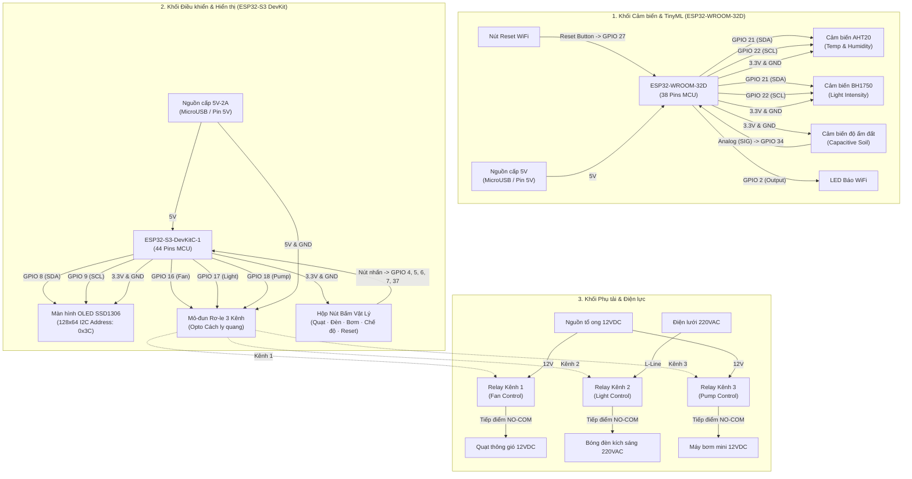

# 4.2. Triển khai phần cứng thực nghiệm

Triển khai phần cứng thực nghiệm là giai đoạn hiện thực hóa thiết kế hệ thống nhằm kết nối các cảm biến vật lý với các vi điều khiển xử lý, đồng thời thiết lập hệ thống rơ-le để đóng ngắt các phụ tải chấp hành (Quạt, Đèn, Bơm). Hệ thống phần cứng trong đồ án được phân tách làm hai khối độc lập: **Khối cảm biến & TinyML (ESP32-WROOM)** và **Khối hiển thị & Điều khiển chấp hành (ESP32-S3)**.

---

### 4.2.1. Sơ đồ nguyên lý mạch đấu nối thiết bị

Dưới đây là sơ đồ nguyên lý đấu nối chi tiết cho từng khối thiết bị vi điều khiển, thể hiện rõ đường cấp nguồn (VCC/GND), các đường truyền tín hiệu số (I2C SDA/SCL, GPIO) và tín hiệu tương tự (Analog ADC).

#### 1. Sơ đồ khối đấu nối tổng thể hệ thống phần cứng

---

#### 2. Bảng đấu nối chân tín hiệu (Pin Mapping)

Để đảm bảo tính chính xác khi thi công lắp đặt phần cứng, sơ đồ chân kết nối của hai vi điều khiển được cấu hình chi tiết như sau:

##### Bảng 4.1. Sơ đồ đấu nối khối cảm biến (ESP32-WROOM-32D)

| STT | Thiết bị ngoại vi | Chân ngoại vi | Chân kết nối ESP32 | Loại giao tiếp | Mức logic / Điện áp | Chức năng nhiệm vụ |
|:---:|:---|:---:|:---:|:---:|:---:|:---|
| 1 | Cảm biến AHT20 | SDA SCL | **GPIO 21** **GPIO 22** | I2C Bus | 3.3V (Logic) 3.3V (VCC) | Đọc chỉ số Nhiệt độ và Độ ẩm môi trường xung quanh định kỳ 5 giây. |
| 2 | Cảm biến BH1750 | SDA SCL | **GPIO 21** **GPIO 22** | I2C Bus | 3.3V (Logic) 3.3V (VCC) | Đọc cường độ ánh sáng môi trường (Lux) để quyết định bù sáng tự động. |
| 3 | Cảm biến độ ẩm đất | SIG/AOUT | **GPIO 34** | Analog Input | ADC 12-bit (0-3.3V) | Đo lượng nước trong đất dưới dạng giá trị điện áp tương tự qua bộ ADC. |
| 4 | LED báo trạng thái | Anode (+) | **GPIO 2** | Digital Output | Active-HIGH (3.3V) | Phát tín hiệu trạng thái kết nối WiFi (nhấp nháy khi cấu hình, sáng khi online). |
| 5 | Nút nhấn WiFi Reset | Pin Signal | **GPIO 27** | Digital Input | Active-LOW (GND) | Nhấn giữ nút trong 6 giây để xóa thông tin WiFi cũ trong bộ nhớ EEPROM/NVS. |

*Lưu ý: Hai cảm biến AHT20 và BH1750 kết nối song song trên bus I2C vật lý nhờ cơ chế định địa chỉ thiết bị duy nhất (AHT20: `0x38`, BH1750: `0x23`).*

##### Bảng 4.2. Sơ đồ đấu nối khối điều khiển chấp hành (ESP32-S3 DevKit)

| STT | Thiết bị ngoại vi | Chân ngoại vi | Chân kết nối ESP32 | Loại giao tiếp | Mức logic / Điện áp | Chức năng nhiệm vụ |
|:---:|:---|:---:|:---:|:---:|:---:|:---|
| 1 | Màn hình OLED SSD1306 | SDA SCL | **GPIO 8** **GPIO 9** | I2C Bus | 3.3V (Logic) 3.3V (VCC) | Hiển thị thông số telemetry nhận được và trạng thái hoạt động của hệ thống. |
| 2 | Kênh Relay 1 (Quạt) | IN1 | **GPIO 16** | Digital Output | Active-HIGH (5V) | Điều khiển đóng cắt Rơ-le kích hoạt quạt thông gió 12VDC. |
| 3 | Kênh Relay 2 (Đèn) | IN2 | **GPIO 17** | Digital Output | Active-HIGH (5V) | Điều khiển đóng cắt Rơ-le kích hoạt bóng đèn sưởi/kích sáng 220VAC. |
| 4 | Kênh Relay 3 (Bơm) | IN3 | **GPIO 18** | Digital Output | Active-HIGH (5V) | Điều khiển đóng cắt Rơ-le kích hoạt máy bơm nước tưới cây 12VDC. |
| 5 | Nút điều khiển quạt | Pin Signal | **GPIO 4** | Digital Input | Active-LOW (GND) | Nhấn nút kích hoạt cơ chế đè lệnh điều khiển quạt thủ công (Manual Override). |
| 6 | Nút điều khiển đèn | Pin Signal | **GPIO 5** | Digital Input | Active-LOW (GND) | Nhấn nút kích hoạt cơ chế đè lệnh điều khiển đèn thủ công (Manual Override). |
| 7 | Nút điều khiển bơm | Pin Signal | **GPIO 6** | Digital Input | Active-LOW (GND) | Nhấn nút kích hoạt cơ chế đè lệnh điều khiển bơm thủ công (Manual Override). |
| 8 | Nút chuyển chế độ | Pin Signal | **GPIO 7** | Digital Input | Active-LOW (GND) | Chuyển đổi qua lại giữa các chế độ hoạt động: Tự động (Auto) $\rightarrow$ Thủ công (Manual) $\rightarrow$ Lịch trình (Scheduled). |
| 9 | Nút Reset WiFi | Pin Signal | **GPIO 37** | Digital Input | Active-LOW (GND) | Nhấn giữ 6 giây để xóa cấu hình WiFi cũ và đưa thiết bị về chế độ Access Point (AP Portal). |

---

#### 3. Các nguyên lý thiết kế mạch và lưu ý an toàn phần cứng

Để đảm bảo phần cứng vận hành bền bỉ trong môi trường độ ẩm cao của nông trại và giảm thiểu tối đa hiện tượng nhiễu tín hiệu, các nguyên lý kỹ thuật sau đã được tuân thủ nghiêm ngặt:

1. **Cách ly quang học (Optoisolation) bảo vệ vi điều khiển:**
   * Module Relay được trang bị optocoupler (cách ly quang) giúp phân tách hoàn toàn mạch điều khiển (điện áp thấp 3.3V - 5V) và mạch động lực (12VDC - 220VAC). Dòng điện kích hoạt rơ-le được cấp từ nguồn 5V ngoài thông qua jumper cách ly `JD-VCC`, tránh xung nhiễu ngược (inductive kickback) do cuộn dây của rơ-le hoặc động cơ bơm tạo ra khi đóng cắt đột ngột gây treo chip ESP32-S3.
2. **Chống rung phím (Debouncing) cho hệ thống nút nhấn:**
   * Các nút bấm vật lý kết nối với chân IO của ESP32 qua chế độ `INPUT_PULLUP` tận dụng điện trở kéo lên tích hợp sẵn trong vi điều khiển.
   * Để chống lại hiện tượng dội phím vật lý khi nhấn nút (gây ra hàng loạt lệnh ON/OFF không mong muốn), hệ thống áp dụng cơ chế chống dội bằng phần mềm (Software Debounce) với hằng số trễ kiểm tra trạng thái `BUTTON_DEBOUNCE_MS = 50ms`.
3. **Phân cấp nguồn điện (Power Decoupling):**
   * Nguồn điện 5V cấp cho vi điều khiển và màn hình OLED được lọc nhiễu thông qua các tụ hóa $100\mu F$ song song với tụ gốm $100nF$ đặt gần chân nguồn để triệt tiêu nhiễu tần số cao.
   * Hệ thống phụ tải (Bơm, Quạt) sử dụng nguồn 12VDC từ nguồn tổ ong riêng biệt, đảm bảo khi động cơ khởi động dòng điện sụt áp tức thời không ảnh hưởng đến điện áp nuôi của hai vi điều khiển ESP32.
