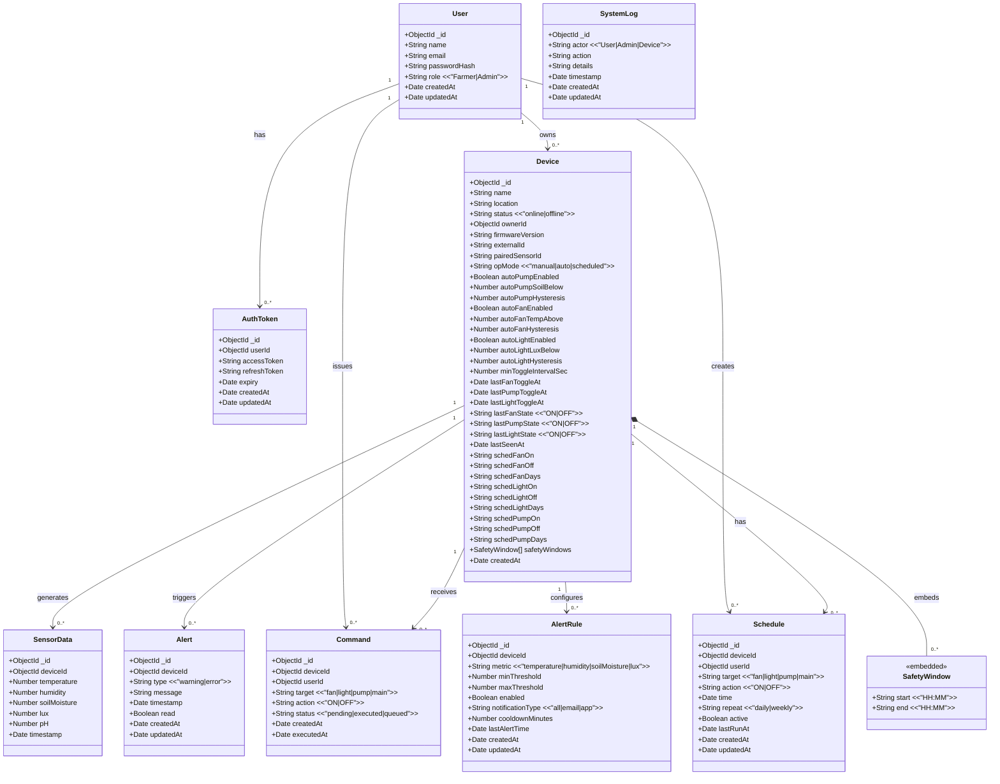
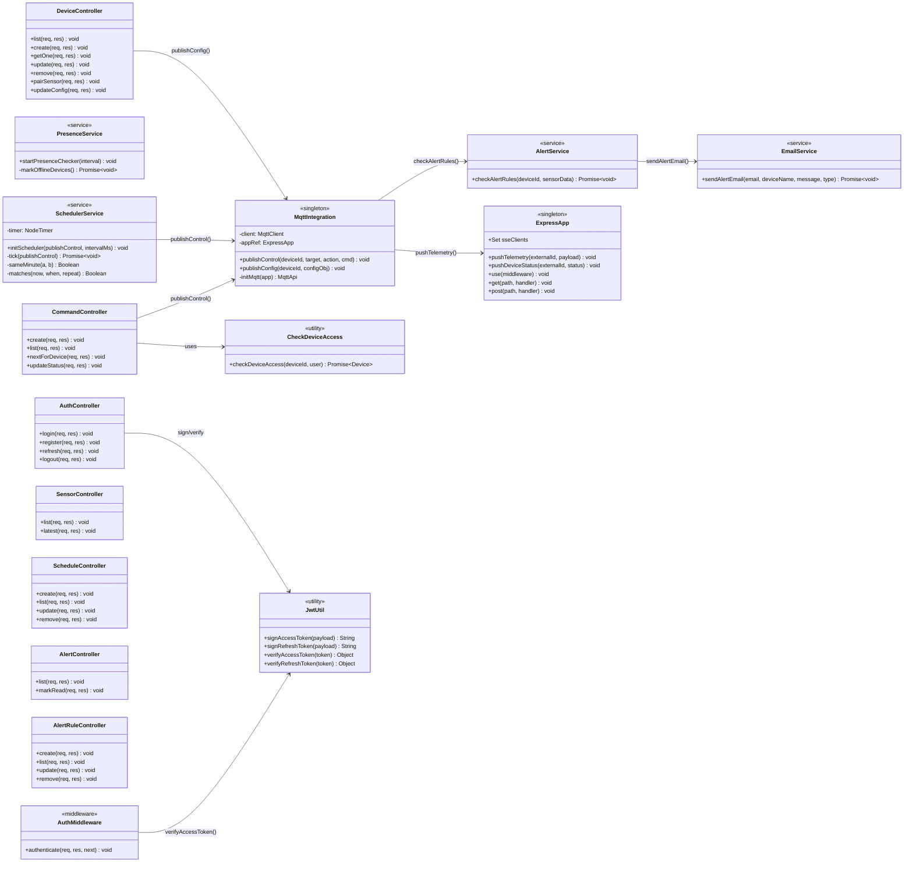
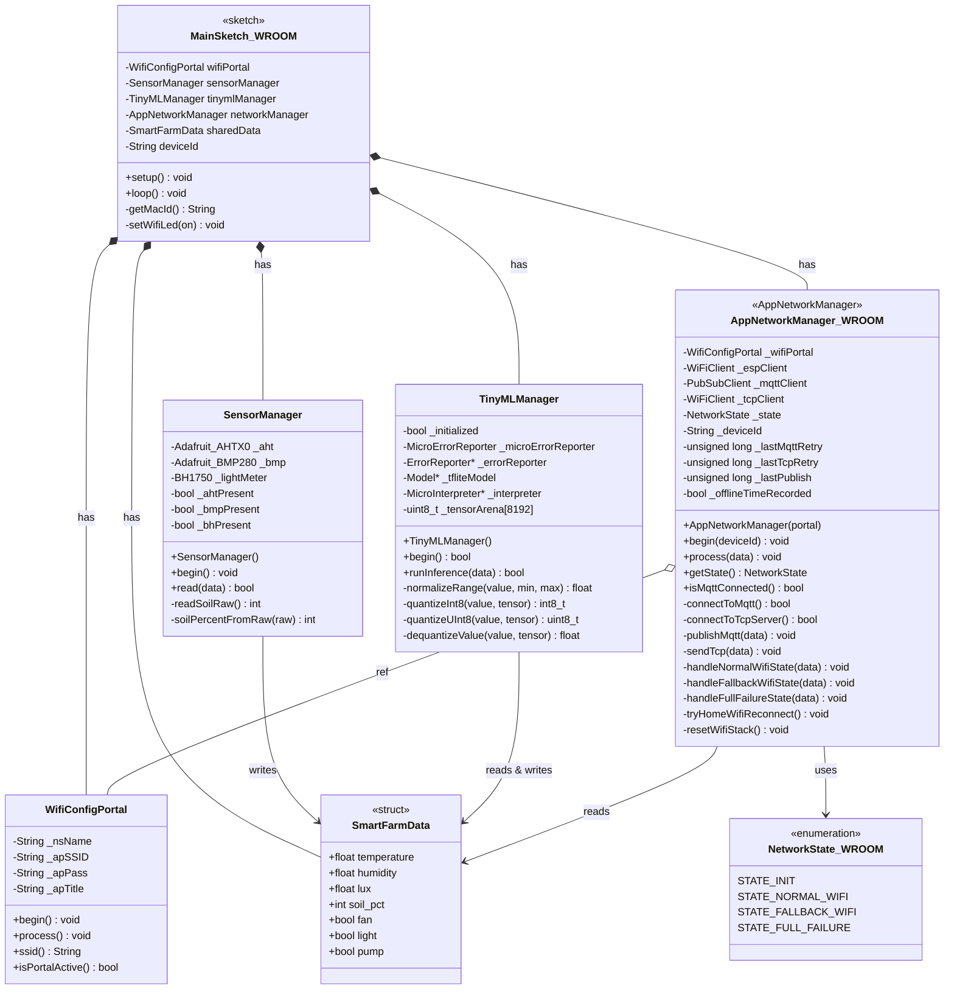
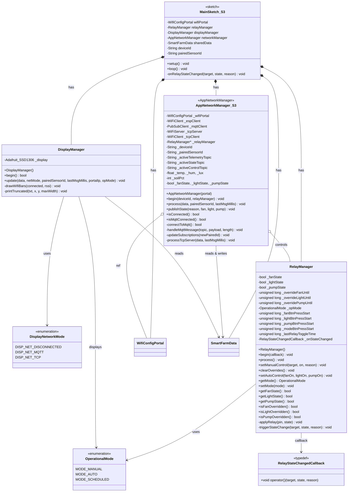

# Sơ đồ Lớp (Class Diagram) — Hệ thống Smart Farm

> **Vai trò:** Database Designer  
> **Phạm vi:** Toàn bộ mã nguồn (Backend · Frontend · ESP32-WROOM · ESP32-S3)

---

## 🗄️ TẦNG 1 — Backend: MongoDB Data Models



---

## ⚙️ TẦNG 2 — Backend: Services & Integrations (Node.js)



---

## 🖥️ TẦNG 3 — Frontend: React Components (Dashboard)

```mermaid
classDiagram
    direction TB

    class AuthContext {
        <<Context>>
        +Object user
        +String accessToken
        +login(email, password) Promise
        +logout() void
        +register(name, email, password) Promise
    }

    class ApiClient {
        <<singleton>>
        +baseURL: String
        +get(path, params) Promise
        +post(path, data) Promise
        +put(path, data) Promise
        +delete(path) Promise
        -interceptors: AxiosInterceptors
    }

    class App {
        <<Router>>
        +routes: Route[]
        -useAuthContext() AuthContext
    }

    class LoginPage {
        -email: String
        -password: String
        +handleSubmit() void
    }

    class RegisterPage {
        -name: String
        -email: String
        -password: String
        +handleSubmit() void
    }

    class DevicesPage {
        -devices: Device[]
        -sseStreams: Map
        -liveData: Map
        +fetchDevices() void
        +sendCommand(deviceId, target, action) void
        +openSSEStream(externalId) EventSource
    }

    class DeviceDetailPage {
        -device: Device
        -activeTab: String
        -liveData: Object
        +fetchDevice() void
        +sendCommand(target, action) void
    }

    class CreateDevicePage {
        -name: String
        -location: String
        +handleSubmit() void
    }

    class SettingsPage {
        -user: User
        -alertRules: AlertRule[]
        +saveProfile() void
        +saveAlertRules() void
    }

    class OverviewTab {
        +device: Device
        +liveData: Object
        -sensorHistory: SensorData[]
    }

    class ControlTab {
        +device: Device
        +liveData: Object
        +sendCommand(target, action) void
        -schedules: Schedule[]
    }

    class AnalyticsTab {
        +device: Device
        -sensorHistory: SensorData[]
        -timeRange: String
    }

    class AutomationPanel {
        +device: Device
        +onSave(config) void
        -thresholds: Object
    }

    class SchedulesPanel {
        +device: Device
        -schedules: Schedule[]
        +createSchedule(data) void
        +deleteSchedule(id) void
    }

    class DeviceSettingsPanel {
        +device: Device
        +onSave(config) void
        -safetyWindows: SafetyWindow[]
    }

    class PairingPanel {
        +device: Device
        +onPair(sensorId) void
    }

    class ControlBox {
        +label: String
        +state: Boolean
        +onToggle(action) void
        -loading: Boolean
    }

    class RealtimeDeviceCard {
        +device: Device
        +liveData: Object
        +onControl(target, action) void
    }

    class MetricChart {
        +data: SensorData[]
        +metric: String
        +timeRange: String
    }

    class AiTab {
        +device: Device
        -aiRecommendation: Object
    }

    class MapTab {
        +devices: Device[]
    }

    class Tabs {
        +tabs: String[]
        +activeTab: String
        +onChange(tab) void
    }

    class UserProfile {
        -user: User
        +onSave(data) void
    }

    class DeviceEditModal {
        +device: Device
        +onSave(data) void
        +onClose() void
    }

    %% Relationships
    App --> AuthContext : provides
    App --> LoginPage : routes
    App --> RegisterPage : routes
    App --> DevicesPage : routes
    App --> DeviceDetailPage : routes
    App --> CreateDevicePage : routes
    App --> SettingsPage : routes

    DevicesPage --> RealtimeDeviceCard : renders
    DevicesPage --> ApiClient : calls
    DeviceDetailPage --> OverviewTab : renders
    DeviceDetailPage --> ControlTab : renders
    DeviceDetailPage --> AnalyticsTab : renders
    DeviceDetailPage --> AiTab : renders
    DeviceDetailPage --> MapTab : renders
    DeviceDetailPage --> Tabs : uses
    DeviceDetailPage --> ApiClient : calls

    ControlTab --> ControlBox : renders
    ControlTab --> AutomationPanel : renders
    ControlTab --> SchedulesPanel : renders
    ControlTab --> DeviceSettingsPanel : renders
    ControlTab --> PairingPanel : renders
    AnalyticsTab --> MetricChart : renders
    SettingsPage --> UserProfile : renders
    DevicesPage --> DeviceEditModal : uses
    AuthContext --> ApiClient : uses
```



---

## 🔌 TẦNG 4 — Firmware ESP32-WROOM (Sensor + TinyML Node)



---

## 🤖 TẦNG 5 — Firmware ESP32-S3 (Controller + MQTT + OLED)



---

## 🔗 TẦNG 6 — Sơ đồ Quan hệ Toàn hệ thống

```mermaid
classDiagram
    direction TB

    class ReactDashboard {
        <<Frontend Layer>>
        +Pages: 6 pages
        +Components: 15 components
        +ApiClient: axios
        +SSE: EventSource
    }

    class NodejsServer {
        <<Backend Layer>>
        +Routes: 9 routers
        +Controllers: 9 controllers
        +Services: alertService, scheduler
        +Middleware: auth, validate, error
        +SSE: push helpers
    }

    class MongoDatabase {
        <<Data Layer>>
        +Collections: User, Device,
        +SensorData, Command,
        +Schedule, Alert,
        +AlertRule, AuthToken, SystemLog
    }

    class MQTTBroker {
        <<Message Broker>>
        +Protocol: MQTT v3.1.1
        +QoS: 1 (at-least-once)
        +Topics: farm/+ / sensors/+ / controllers/+
    }

    class ESP32_WROOM {
        <<Sensor Node>>
        +SensorManager: DHT/AHT, BMP, BH1750
        +TinyMLManager: TensorFlow Lite Micro
        +AppNetworkManager: MQTT + TCP Client
        +WifiConfigPortal: Captive Portal
    }

    class ESP32_S3 {
        <<Controller Node>>
        +RelayManager: Fan, Pump, Light
        +DisplayManager: SSD1306 OLED
        +AppNetworkManager: MQTT + TCP Server
        +WifiConfigPortal: Captive Portal
    }

    ReactDashboard --> NodejsServer : REST API (JWT Bearer)
    ReactDashboard --> NodejsServer : SSE /api/stream/devices/:id
    NodejsServer --> MongoDatabase : Mongoose ODM
    NodejsServer --> MQTTBroker : PUBLISH control commands
    MQTTBroker --> NodejsServer : SUBSCRIBE telemetry / state / ack
    MQTTBroker --> ESP32_S3 : DELIVER control commands (QoS=1)
    MQTTBroker --> ESP32_WROOM : DELIVER state feedback
    ESP32_WROOM --> MQTTBroker : PUBLISH telemetry + ai_state
    ESP32_S3 --> MQTTBroker : PUBLISH state + cmd/ack
    ESP32_WROOM --> ESP32_S3 : TCP fallback (SoftAP 192.168.4.1:8080)
```

---

## 📋 Bảng Tổng Hợp Classes / Entities

| Layer | Class/Entity | Loại | Trách nhiệm chính |
|---|---|---|---|
| **DB Model** | `User` | Mongoose Schema | Quản lý tài khoản người dùng |
| **DB Model** | `Device` | Mongoose Schema | Cấu hình & trạng thái thiết bị IoT |
| **DB Model** | `SensorData` | Mongoose Schema | Lưu trữ lịch sử đo lường |
| **DB Model** | `Command` | Mongoose Schema | Lệnh điều khiển từ User/Scheduler |
| **DB Model** | `Schedule` | Mongoose Schema | Lịch trình tự động hóa |
| **DB Model** | `Alert` | Mongoose Schema | Cảnh báo được kích hoạt |
| **DB Model** | `AlertRule` | Mongoose Schema | Ngưỡng kích hoạt cảnh báo |
| **DB Model** | `AuthToken` | Mongoose Schema | JWT access/refresh token |
| **DB Model** | `SystemLog` | Mongoose Schema | Nhật ký hành động hệ thống |
| **Service** | `AlertService` | Singleton | Kiểm tra ngưỡng, tạo alert, gửi email |
| **Service** | `SchedulerService` | Singleton | Chạy lịch tự động (mỗi 30s) |
| **Service** | `EmailService` | Singleton | Gửi email thông báo qua SMTP |
| **Service** | `PresenceService` | Singleton | Đánh dấu thiết bị offline |
| **Integration** | `MqttIntegration` | Singleton | Pub/Sub MQTT Broker |
| **Infra** | `ExpressApp` | Singleton | HTTP Server + SSE |
| **Frontend** | `AuthContext` | React Context | Quản lý phiên đăng nhập |
| **Frontend** | `ApiClient` | axios | HTTP client với JWT interceptor |
| **Frontend** | `DevicesPage` | React Page | Danh sách thiết bị + SSE streams |
| **Frontend** | `DeviceDetailPage` | React Page | Chi tiết thiết bị (multi-tab) |
| **ESP32 WROOM** | `SensorManager` | C++ Class | Đọc cảm biến AHT/BMP/BH1750/Soil |
| **ESP32 WROOM** | `TinyMLManager` | C++ Class | Suy luận TensorFlow Lite Micro |
| **ESP32 WROOM** | `AppNetworkManager` | C++ Class | Quản lý MQTT + TCP Client + WiFi FSM |
| **ESP32 S3** | `RelayManager` | C++ Class | Điều khiển relay Fan/Pump/Light |
| **ESP32 S3** | `DisplayManager` | C++ Class | Hiển thị OLED SSD1306 |
| **ESP32 S3** | `AppNetworkManager` | C++ Class | MQTT + TCP Server + WiFi |
| **Shared** | `SmartFarmData` | C++ Struct | Giao thức dữ liệu dùng chung |
| **Shared** | `WifiConfigPortal` | C++ Class | Captive portal cấu hình WiFi |
