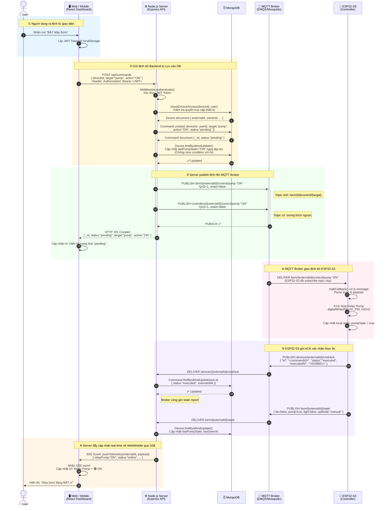
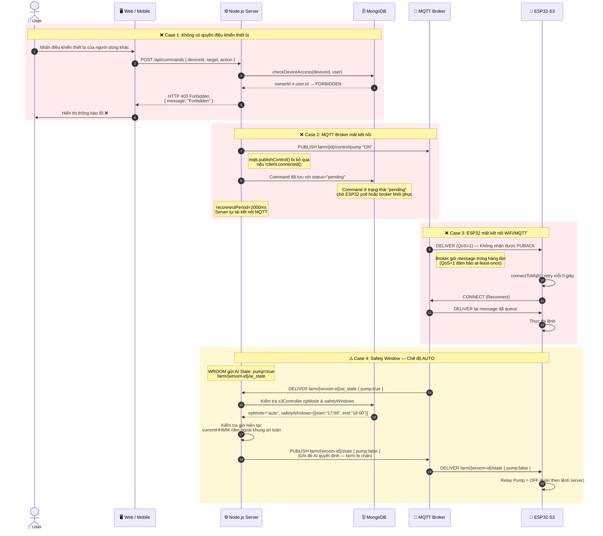
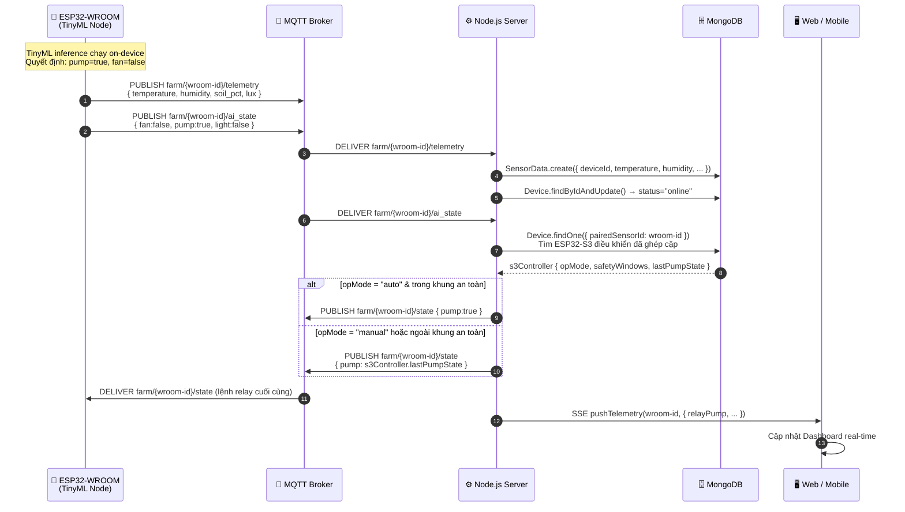

# Sơ đồ Tuần tự: Gửi Lệnh Điều Khiển từ Web/Mobile → MQTT Broker → ESP32

> **Vai trò:** Database Designer  
> **Chức năng:** Gửi lệnh điều khiển thiết bị (Fan / Pump / Light) từ giao diện người dùng tới ESP32 qua hệ thống MQTT.

---

## 🗂️ Các Thành Phần Tham Gia (Actors & Components)

| Ký hiệu | Mô tả | Công nghệ |
|---|---|---|
| **User** | Người dùng thao tác trên giao diện | - |
| **Web/Mobile** | Giao diện React Dashboard | React + Vite |
| **Node.js Server** | Backend xử lý API & publish MQTT | Express.js |
| **MongoDB** | Cơ sở dữ liệu lưu lệnh & trạng thái | MongoDB / Mongoose |
| **MQTT Broker** | Trung gian nhắn tin pub/sub | EMQX / Mosquitto |
| **ESP32-S3** | Bộ điều khiển relay chính | Arduino/ESP-IDF |
| **ESP32-WROOM** | Node cảm biến + TinyML | Arduino |

---

## 📊 Sơ đồ Tuần tự — Luồng Chính (Happy Path)



---

## 📊 Sơ đồ Tuần tự — Luồng Lỗi & Edge Cases



---

## 🔄 Luồng Ngược: ESP32-WROOM gửi AI State (TinyML)



---

## 📋 Bảng Tổng Hợp MQTT Topics

| Topic Pattern | Hướng | QoS | Retain | Mô tả |
|---|---|---|---|---|
| `farm/{deviceId}/control/{target}` | Server → ESP32 | 1 | false | Lệnh điều khiển relay (mới) |
| `controllers/{deviceId}/control/{target}` | Server → ESP32 | 1 | false | Lệnh điều khiển relay (cũ, tương thích ngược) |
| `farm/{deviceId}/telemetry` | ESP32 → Server | 1 | false | Dữ liệu cảm biến từ WROOM |
| `farm/{deviceId}/state` | Server → ESP32 | 1 | false | Trạng thái relay đã duyệt |
| `farm/{deviceId}/ai_state` | WROOM → Server | 1 | false | Quyết định AI từ TinyML |
| `farm/{deviceId}/config` | Server → ESP32 | 1 | **true** | Cấu hình retained cho S3 |
| `devices/{deviceId}/cmd/ack` | ESP32 → Server | 1 | false | Xác nhận thực thi lệnh |
| `sensors/{deviceId}/data` | ESP32 → Server | 1 | false | Telemetry (topic cũ) |
| `sensors/{deviceId}/status` | ESP32 → Server | 1 | false | Online/Offline status |
| `controllers/{deviceId}/state` | ESP32 → Server | 1 | false | Trạng thái relay (topic cũ) |

---

## 🗃️ Schema Collection Liên Quan

### Collection `commands`
```json
{
  "_id": "ObjectId",
  "deviceId": "ObjectId (ref: devices)",
  "userId": "ObjectId (ref: users)",
  "target": "fan | light | pump | main",
  "action": "ON | OFF",
  "status": "pending | executed | queued",
  "executedAt": "Date (nullable)",
  "createdAt": "Date"
}
```

### Collection `devices` (trường liên quan đến control)
```json
{
  "_id": "ObjectId",
  "externalId": "String (MQTT device ID)",
  "pairedSensorId": "String (WROOM node ID)",
  "opMode": "manual | auto | scheduled",
  "lastFanState": "ON | OFF",
  "lastPumpState": "ON | OFF",
  "lastLightState": "ON | OFF",
  "lastFanToggleAt": "Date",
  "lastPumpToggleAt": "Date",
  "lastLightToggleAt": "Date",
  "safetyWindows": [{ "start": "HH:MM", "end": "HH:MM" }],
  "status": "online | offline",
  "lastSeenAt": "Date"
}
```

---

## 🔐 Cơ Chế Bảo Mật

```
Web/Mobile ──── JWT Token ────► Node.js Server
                                     │
                                 authenticate()
                                     │
                              checkDeviceAccess()
                                     │
                          ownerId == user.id? ──── ❌ 403 Forbidden
                                     │ ✅
                              Tiếp tục luồng
```

---

## ✅ Tổng Kết Luồng Chính

```
User → Web/Mobile → POST /api/commands (JWT)
     → Server authenticate & checkDeviceAccess
     → MongoDB: Command.create (status: pending)
     → MongoDB: Device.update (lastPumpState ngay lập tức)
     → MQTT Publish: farm/{id}/control/pump "ON" (QoS=1)
     → HTTP 201 trả về ngay
     → MQTT Broker deliver tới ESP32-S3
     → ESP32-S3: kích hoạt relay
     → ESP32-S3: PUBLISH cmd/ack & state
     → Server: Command.update (status: executed)
     → Server: SSE pushTelemetry
     → Web/Mobile: Cập nhật UI real-time ✅
```
